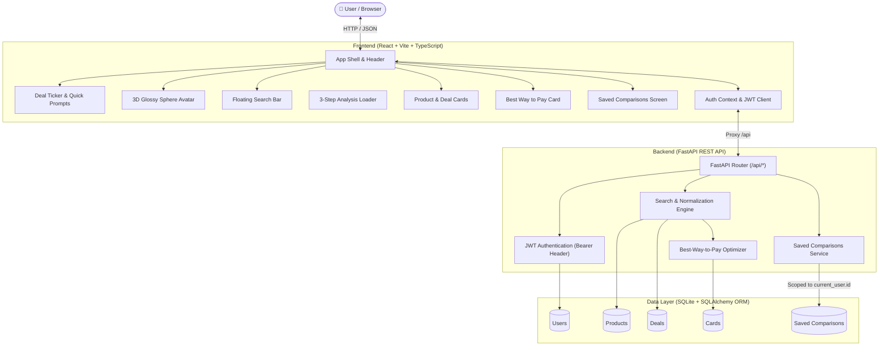
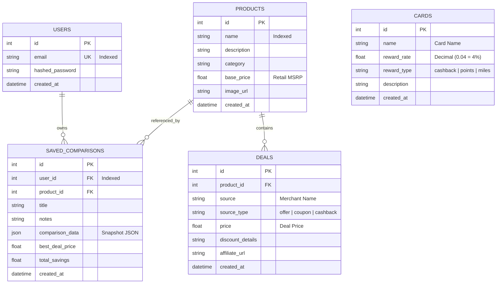

# BillGPT — Smart Deal Comparison & Payment Optimization Engine

**BillGPT** is a full-stack web application that compares competing merchant deals across sources, calculates the cheapest merchant price, evaluates available credit card reward tiers, and recommends the **Best Way to Pay** to maximize consumer savings.

---

## 🏗️ Architecture Diagram



---

## 💻 Tech Stack

### Frontend
- **Framework**: React 18 / TypeScript
- **Bundler / Tooling**: Vite 5+
- **Styling**: Vanilla CSS Design System (Custom variables, warm radiant yellow gradient, cream card surfaces, responsive layouts)
- **Typography**: Google Fonts (*Plus Jakarta Sans*)
- **Icons**: Handcrafted SVG vector icons

### Backend
- **Framework**: FastAPI (Asynchronous Python REST framework)
- **ASGI Server**: Uvicorn
- **ORM & Database**: SQLAlchemy 2.0 with SQLite
- **Data Validation & Serializers**: Pydantic v2
- **Password Security**: Direct `bcrypt` hashing with salt generation
- **Token Security**: `python-jose` (HS256 signed JWT tokens)
- **Testing**: `pytest`, `httpx`

---

## 🗄️ Database Schema



### Table Definitions & Notes
1. **`users`**: Secure credential store with unique indexed email and bcrypt password hash.
2. **`products`**: Catalog items storing base retail MSRP (`base_price`).
3. **`deals`**: Competing merchant offers linked to a product (e.g. Amazon, Best Buy, B&H Photo, Target).
4. **`cards`**: Credit card reward profiles stored with standardized decimal rates (`0.04` for 4%, `0.03` for 3%).
5. **`saved_comparisons`**: Stores point-in-time JSON snapshots (`comparison_data`) of the evaluated deal state to prevent historical alteration when catalog prices change. Strict user ownership is enforced at the query level.

---

## 🧮 Best-Way-to-Pay Calculation Engine

The optimization algorithm runs dynamically on every search query:

1. **Cheapest Merchant Deal**:
   $$\text{Cheapest Deal} = \min_{d \in \text{Deals}} (\text{Price}_d)$$
2. **Card Reward Calculation**:
   For each available reward card $c$:
   $$\text{Reward Earned}_c = \text{Cheapest Price} \times \text{Reward Rate}_c$$
   $$\text{Effective Net Price}_c = \text{Cheapest Price} - \text{Reward Earned}_c$$
3. **Optimal Payment Selection**:
   $$\text{Best Effective Price} = \min \left(\text{Cheapest Price}, \min_{c} (\text{Effective Net Price}_c) \right)$$
4. **Total Net Savings vs MSRP**:
   $$\text{Total Savings} = \text{Base Retail MSRP} - \text{Best Effective Price}$$
   $$\text{Savings Percentage} = \left( \frac{\text{Total Savings}}{\text{Base Retail MSRP}} \right) \times 100$$

*Card rewards are treated separately from merchant-level discounts to prevent double-counting.*

---

## 📡 API Endpoints Reference

| Method | Endpoint | Description | Auth Required |
| :--- | :--- | :--- | :---: |
| `GET` | `/` | Service health and quick navigation links | No |
| `GET` | `/api/health` | Application health check status | No |
| `POST` | `/api/auth/register` | Register new user and receive JWT token | No |
| `POST` | `/api/auth/login` | Authenticate user and receive JWT token | No |
| `GET` | `/api/auth/me` | Fetch authenticated user profile | **Yes** (Bearer) |
| `GET` | `/api/deals/search?q=` | Search products, compare deals & compute best pay | No |
| `GET` | `/api/saved-comparisons` | List comparisons owned by authenticated user | **Yes** (Bearer) |
| `POST` | `/api/saved-comparisons` | Save a comparison snapshot | **Yes** (Bearer) |
| `DELETE` | `/api/saved-comparisons/{id}` | Delete a saved comparison (scoped to owner) | **Yes** (Bearer) |

---

## 🚀 Setup & Installation Guide

### Prerequisites
- **Python 3.10+**
- **Node.js 18+** and **npm**

---

### Step 1: Clone Repository
```bash
git clone https://github.com/Vardhan2006/BillGPT.git
cd BillGPT
```

---

### Step 2: Backend Setup
1. **Create and activate Python virtual environment**:
   ```powershell
   # Windows PowerShell
   python -m venv backend/venv
   backend\venv\Scripts\Activate.ps1
   ```
   ```bash
   # macOS / Linux
   python3 -m venv backend/venv
   source backend/venv/bin/activate
   ```

2. **Install dependencies**:
   ```bash
   pip install -r requirements.txt
   ```

3. **Seed Database with initial products, deals, cards, and demo user**:
   ```bash
   python -m backend.seed
   ```

4. **Run Backend Test Suite**:
   ```bash
   pytest -v
   ```

5. **Start FastAPI Backend Server**:
   ```bash
   uvicorn backend.main:app --reload --port 8000
   ```
   - **Backend API**: `http://localhost:8000`
   - **Swagger Docs**: `http://localhost:8000/docs`

---

### Step 3: Frontend Setup
Open a new terminal window:

1. **Navigate to frontend directory**:
   ```bash
   cd frontend
   ```

2. **Install Node dependencies**:
   ```bash
   npm install
   ```

3. **Build check (TypeScript & Assets)**:
   ```bash
   npm run build
   ```

4. **Start Vite Development Server**:
   ```bash
   npm run dev
   ```
   - **Application UI**: `http://localhost:5173`

---

## 🔑 Demo Credentials

A demo account is pre-seeded in the database for instant testing:
- **Email**: `test@example.com`
- **Password**: `password123`

*(The Sign In modal features an **"Autofill Demo Credentials"** button for 1-click login).*

---

## 🛡️ Security & Design Decisions

Detailed architectural rationales and design tradeoffs are documented in [DECISIONS.md](DECISIONS.md):
- **Direct Bcrypt**: Avoids deprecated `passlib` compatibility issues with modern bcrypt 4.x/5.x.
- **Strict Query Scoping**: IDOR prevention via `filter(user_id == current_user.id)` returning `404` for non-owned entities.
- **Snapshot Storage**: Immutable JSON point-in-time records for saved deal comparisons.
- **Token Persistence**: JWT Bearer authentication stored in `localStorage` for local take-home evaluation.

---

## 📱 Responsive Design Verification

The frontend UI is tested and verified across standard device viewports:
- **Desktop Widescreen**: 1920 × 1080
- **Laptop**: 1440 × 900
- **Tablet Landscape**: 1024 × 768
- **Tablet Portrait**: 768 × 1024
- **Mobile**: 390 × 844 (iPhone 14/15) & 375 × 667 (iPhone SE)

---

## 📄 License
MIT License. Built for the BillGPT Take-Home Assessment.
